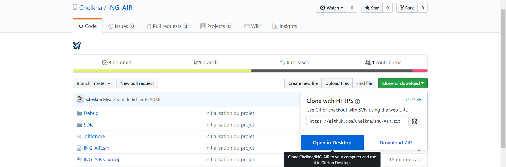
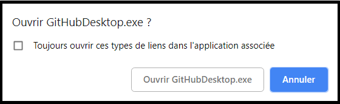
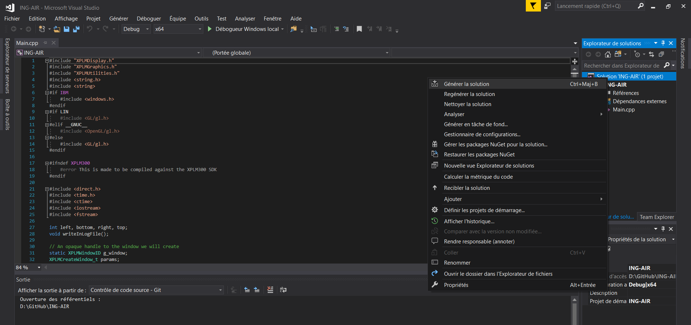
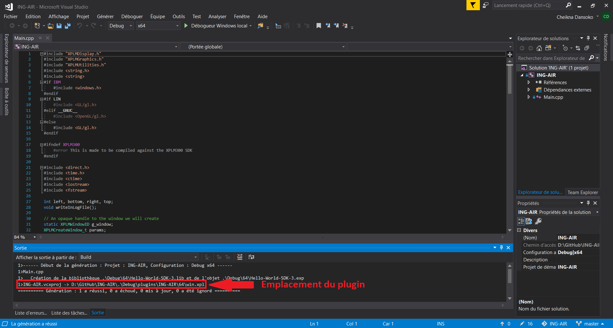

# ING-AIR ✈️

# Mise en place du projet
Après avoir créer un compte sur gitHub, installer gitHub Desktop.
Une fois le lien d'invitation pour le project accepté, cloner le projet.

Pour cloner le projet :
chercher le projet sur gitHub.com (si vous ne le trouver pas cliquez sur le logo de gitHub en haut à gauche de la page et rechercher le répertoire dans la partie gauche nommée Repositories).
Une fois le projet trouvé, cliquer sur 'Clone or download' puis 'Open in Desktop'

Une fenêtre devrait s'afficher pour vous demander d'ouvrir GitHubDesktop.exe. Cliquer sur Ouvrir

GitHubDesktop devrait s'ouvrir en vous demandant de choisir l'emplacement local que vous voulez pour le clonage. Choisissez l'emplacement que vous voulez.

Enfin, ouvrir le fichier .sln pour commencer à travailler.

# Génération & Installation d'un plugin
Après avoir ouvert le projet, fait un clique-droit sur la solution, puis cliquer sur 'Générer la solution'

Une fois la solution compilée, se rendre jusqu'au dossier ING-AIR (pas besoin d'aller jusqu'au fichier .xpl), en regarder le chemin indiqué dans la console.

Copier le dossier ING-AIR dans le dossier plugins du jeu X-Plane 11 (pour trouver le dossier plugins suivre le chemin: X-Plane 11\Resources\plugins)

Le plugin est prêt à être utilisé.

