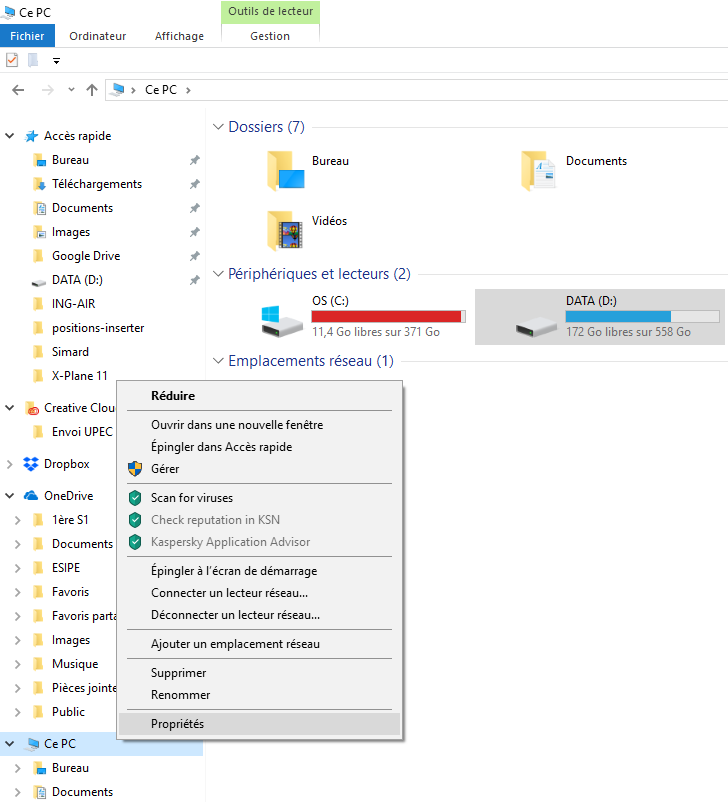

# ING-AIR ✈️

# Prérequis
  **- Visual Studio 2017**
  
  **- Python 2.7.15**

# Mise en place du projet
Après avoir créer un compte sur gitHub, installer gitHub Desktop.
Une fois le lien d'invitation pour le project accepté, cloner le projet.

Pour cloner le projet :
chercher le projet sur gitHub.com (si vous ne le trouver pas cliquez sur le logo de gitHub en haut à gauche de la page et rechercher le répertoire dans la partie gauche nommée Repositories).
Une fois le projet trouvé, cliquer sur 'Clone or download' puis 'Open in Desktop'


Une fenêtre devrait s'afficher pour vous demander d'ouvrir GitHubDesktop.exe. Cliquer sur Ouvrir


GitHubDesktop devrait s'ouvrir en vous demandant de choisir l'emplacement local que vous voulez pour le clonage. Choisissez l'emplacement que vous voulez.


Enfin, ouvrir le fichier .sln pour commencer à travailler.

# Utilisation du projet
- Si vous ne comptez pas modifier le projet, mais juste tester directement le plugin. Il vous suffit de télécharger le projet, pas besoin de le cloner.
- Placez le dossier 'ING_AIR' (se situant dans le dossier 'bin') dans le dossier plugins de X-Plane (X-Plane 11\Resources\plugins)

# Organisation du projet
## Le projet se découpe en deux grandes parties

### 1ère partie : le dossier **_positions-retriver_**
Ce dossier dont les scripts ont principalement été écrits en C++ permet la récupération de la position de l'avion dans le jeu X-Plane 1 via un plugin. Ce dernier va enregister les positions dans un fichier texte. Le nom du fichier texte est donné dans la classe Aircraft.h

### 2ème partie : le dossier **_positions-inserter_**
Ce dossier dont les scripts ont principalement été écrits en python permet l'insertion de données dans une BDD SQLite. En effet, le but de la partie précédente était d'écrire les positions de l'avion dans un fichier texte. Le script _positions-reader-inserter.py_ va se charger de lire les positions qui ont été enregistrées puis de les sauvegarder en base de données.

# Mise en place du système de récupération des positions de l'avion : Génération & Installation du plugin (sur Windows)
Après avoir ouvert le projet, fait un clique-droit sur la solution, puis cliquer sur 'Générer la solution'


Une fois la solution compilée, se rendre jusqu'au dossier ING-AIR (pas besoin d'aller jusqu'au fichier .xpl), en regardant le chemin indiqué dans la console.


Copier le dossier ING-AIR dans le dossier plugins du jeu X-Plane 11 (pour trouver le dossier plugins suivre le chemin: X-Plane 11\Resources\plugins)

Le plugin est prêt à être utilisé.

# Mise en place du système d'enregistrement des positions dans une base de données SQLite (sur Windows)
## Installation et configuration de Python
1.Installez la version 2.7 de Python disponible sur le site officiel : https://www.python.org/ftp/python/2.7.15/python-2.7.15.msi

2.Assurez vous d'avoir python en tant que "variable d'environnement". Pour le savoir lancez l'invite de commande et lancez la commande :
```
C:>python
```
Normalement, la version de python qui a été installée devrait s'afficher.

3.Une fois installé, rendez-vous dans le dossier _Python_ (souvent à la racine du disque C:), puis _DLLs_

4.Renommez le fichier sqlite3.dll présent en sqlite3_old.dll (si aucun fichier sqlite3.dll ne se trouve dans ce dossier, vous pouvez sauter cette étape)
**_Cette étape est nécessaire afin de ne pas utiliser la librairie sqlite3 fournie par python mais plutôt celle fournie par le module spatialite que nous verrons dans la suite_**

5.Dans l'archive du projet téléchargé précédemment, copier le fichier sqlite3.dll (présent dans le dossier bin) et le coller dans le dossier _DLLs_ ou vous venez de renommer le fichier sqlite3.dll). A la fin vous vous retrouverez avec un fichier sqlite3.dll et un fichier sqlite3_old.dll


_Ici le dossier Python a été renommé en Python27_


## Installation du module sqlite
1.Si le projet n'a pas été téléchargé, téléchargez le et décompressez-le.

2.Rendez-vous dans le dossier bin et copier le dossier _mod_spatialite_ dans le dossier _Program Files (x86)_ à la racine de votre disque C: (ou un autre dossier dont vous vous souviendrez pour la suite).

3.Paramétrez les variables d'environnement afin de prendre en compte les librairies présentes dans ce dossier et pour ce faire:
- Ouvrir un _Explorateur de fichier_
- Faire un clique-droit sur _Ce PC_ dans le panneau de gauche, puis cliquez sur _Propriétés_. Une nouvelle fenêtre s'ouvre.

- Cliquer sur _Variables d'environnement..._, puis dans la partie du bas nommée _Varibles système_, défiler jusqu'à voir _Path_ dans la colonne _Variable_
- Double-cliquer sur _Path_ et une nouvelle fenêtre s'ouvre.
- Cliquer sur nouveau est y mettre le chemin jusqu'au éléments nom du dossier _mod_spatialite_. Dans notre cas : 
```
C:\Program Files (x86)\mod_spatialite
```

- Enfin cliquer sur les boutons _OK_ de toutes les fenêtres afin de valider toutes les modifications

# Exécution du plugin et visualisation sur QGIS (sur Windows)
## Création de la base de données
1.Dans le dossier _positions-inserter_ du dossier téléchargé au début, copiez le fichier _positions-reader-inserter.py_ et collez-le à la racine du dossier X-Plane


2. Ouvrez l'invite de commande et rendez-vous à la racine du dossier X-Plane ou alors dans le dossier X-Plane, faites _Shift + Clic Droit_ et _Ouvrir la fenêtre PowerShell ici_

3.Lancez la commande :
```
D:\Games\X-Plane>python positions-reader-inserter.py
```

4. Le fichier de base de données sqlite et la table, qui vont permettre la sauvegarde des données, seront alors en cours de création.

5. Si le message ci-dessous s'affiche, alors ne vous inquiétez pas, celà veut juste dire que la table avec les éléments qui seront nécessaires a déjà été créée.


## Liaison entre la base de données et QGIS
1.Installez QGIS, pour la suite nous utiliserons la version 3.2.3 de QGIS

2.Lancez QGIS

3.Dans la barre de Menu en haut cliquez sur 'Base de donnée' puis 'DB Manager...'


4.Une nouvelle fenêtre s'ouvre, puis faites un clique-droit sur 'Spatialite' puis 'Nouvelle connexion...'


5.Une autre fenêtre s'ouvre où vous devrez choisir le fichier _'position.sqlite'_ qui a été créé dans le dossier X-Plane lors de l'exécution du script Python _positions-reader-inserter.py_ et cliquez sur _Ouvrir_


6.La couche devrait être créée automatiquement dans la partie gauche (_ici ING_AIR_) et dans la rubrique **SpatiaLite** les informations sur la colonnes qui est de type geometry devrait s'afficher. Puis double-cliquez sur **ING-AIR** (à gauche juste en dessous de position.sqlite)


7.Pour ajouter une carte en fond, cliquez sur 'Internet', 'QuickMap Services' puis 'Panneau Search QMS'.


8.Un nouveau panneau apparait à droite et cherchez une map. Nous avons choisi 'Google Satellite Hybrid'.


9.Ensuite, cliquez sur le bouton 'Add' et la carte devrait s'afficher sur l'écran.


10.Enfin afin de lire régulièrement les positions, faire un clique-droit sur ING-AIR dans le panneau de gauche, puis cliquez sur 'Propriétés'


11.Sur la nouvelle fenêtre qui s'affiche, cliquez sur 'Rendu' (le bouton avec une icône de pinceau), puis cochez la case 'Rafraîchir la couche toutes les (secondes)', entrez un intervalles. Enfin cliquez sur le bouton 'OK'


## Amusez-vous
Enfin lancez le jeu X-Plane est observez vos déplacement sur la carte de QGIS.
